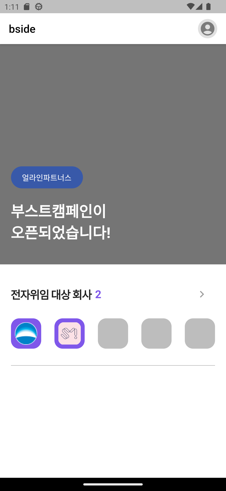
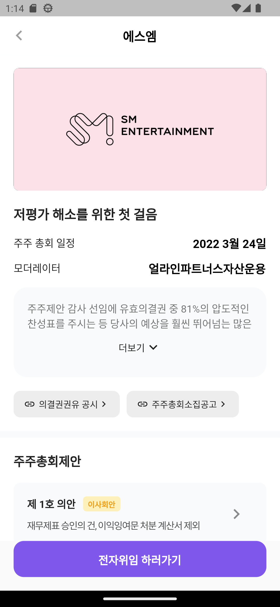
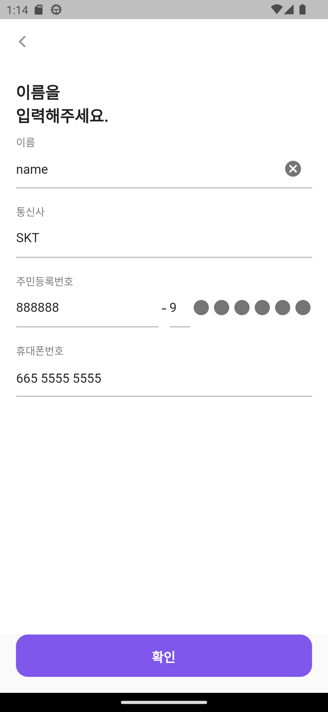
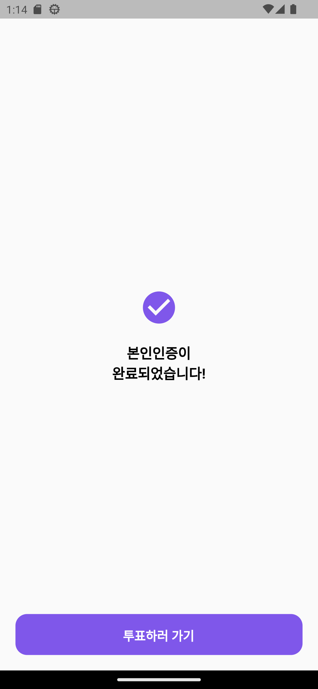
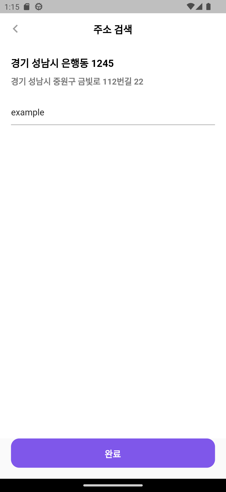
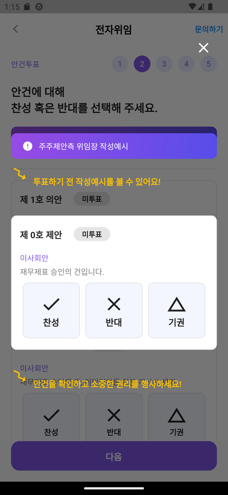
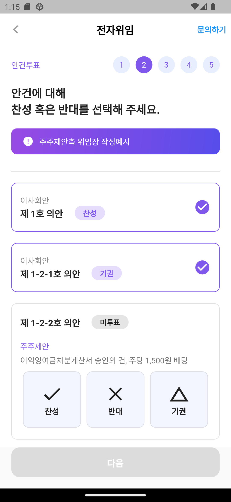
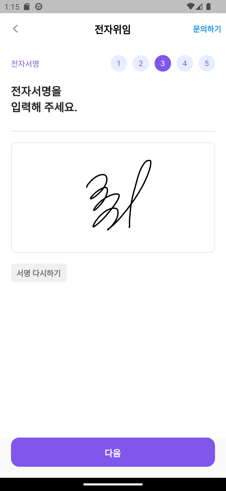
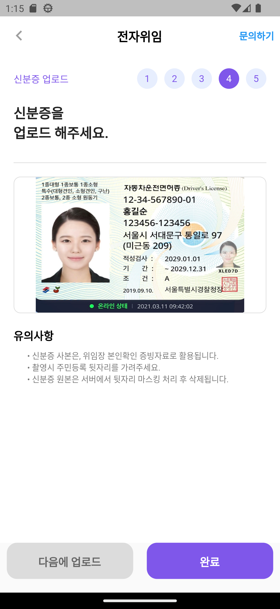
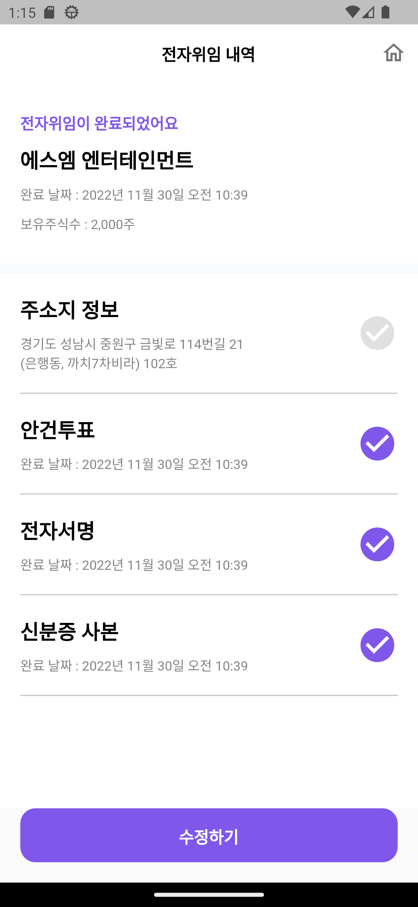

# 📖📖 Bside App 전자위임 prototype

## About The Project

본 repository는 bside의 사전과제 관련 저장소입니다.

과제 설명 :
* 주어진 영상을 참고하여 전자위임의 화면 구현
* 회사 기술 스택인 Flutter를 이용하여 구현
* UI 구현과 작동 가능한 Prototype으로 빌드해야 함.

<p align="right">(<a href="#readme-top">back to top</a>)</p>


## 💻 Requirements

- Android에 최적화 된 prototype.
- Flutter SDK가 설치 되어있어야함. (ie. IntelliJ, Android Studio, VSCode etc)
- A little knowledge of Dart and Flutter

## 📸 ScreenShots


| Home                             | Introduce                              |
| --------------------------------- | --------------------------------- |
|   |   |
| Auth                             | Auth Success                              |
| --------------------------------- | --------------------------------- |
|   |   |
| Search                             | Popup                              |
| --------------------------------- | --------------------------------- |
|   |   |
| Commission vote                           | Commission Sign                              |
| --------------------------------- | --------------------------------- |
|   |   |
| Commission id card                           | Last Screen                              |
| --------------------------------- | --------------------------------- |
|   |   |


<!-- GETTING STARTED -->
## Getting Started

이것은 프로젝트를 로컬로 설정하는 방법에 대한 지침을 제공하는 방법의 예입니다. 로컬 복사본을 시작하고 실행하려면 다음 간단한 예제 단계를 따르십시오.


### Installation

_아래는 앱 설치 및 설정을 지시하는 방법의 예입니다. 이 템플릿은 외부 종속성 또는 서비스에 의존하지 않습니다._

1. Clone the repo
   ```sh
   git clone https://github.com/dnckd94252/bside.git
   ```
2. Install Flutter packages
   ```sh
   flutter pub get
   ```
3. Run Flutter debug apk
   ```sh
   flutter run
   ```
